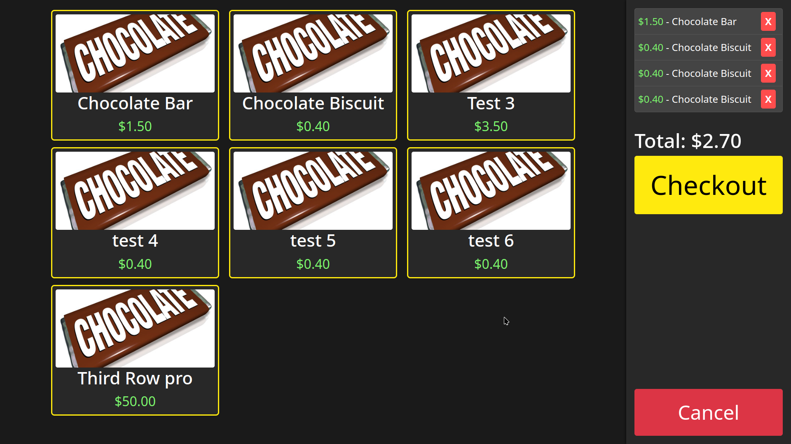

# BaronPay

A self-service point of sale kiosk web application built with Django. Designed for touchless checkout using RFID card readers that function as USB HID devices. The system uses a hidden text input field to capture card scans, enabling quick product selection and payment processing without physical interaction. Cart items preserve historical pricing, and all transactions are tracked through the Django admin interface.



## Getting Started

```bash
# Install dependencies
python -m venv .venv
source .venv/bin/activate
pip install -r requirements.txt

# Navigate to Django project
cd webapp

# Run migrations
python manage.py migrate

# Start development server
python manage.py runserver

# Create 12 dummy products with random prices ($0.20-$5.00)
python manage.py populate_products

# Clear existing products and create new ones
python manage.py populate_products --clear
```

Access the kiosk at `http://127.0.0.1:8000/` and admin at `http://127.0.0.1:8000/admin/` (create superuser with `python manage.py createsuperuser`).